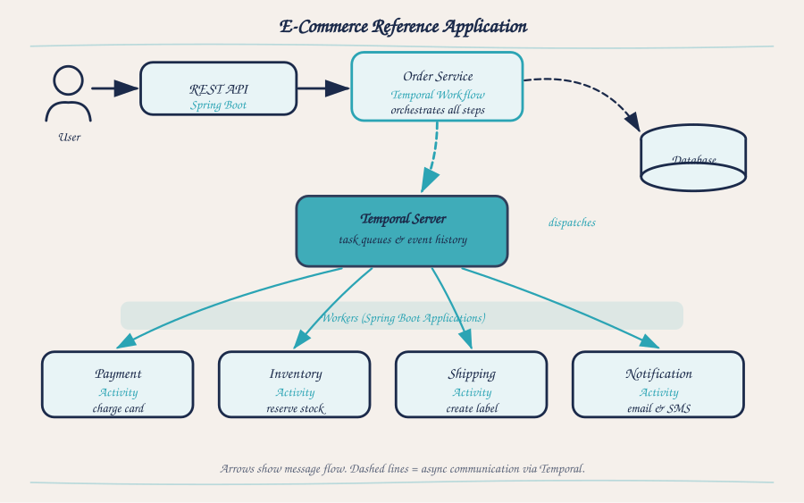
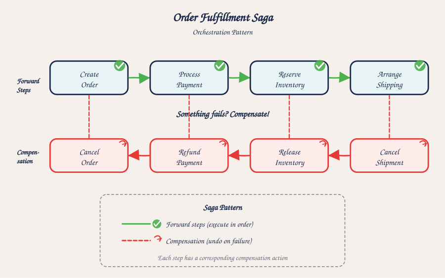

# Temporal + Spring Boot — Examples and Katas

Runnable [Temporal](https://temporal.io) examples for Java teams: a reference order-fulfillment service, plus **six graded katas** covering sagas, compensation, human-in-the-loop approval, scheduled-job migration, retry semantics, and workflow versioning.

**Java 21 · Spring Boot 3.4 · Temporal Java SDK 1.34 · Maven · MIT licensed**

Everything here boots with one `docker compose up` and is verified end-to-end by [`test-all.sh`](#verify-everything-works--test-allsh) — clone it, run the script, and you have a working Temporal stack with a real saga executing against it in about three minutes.

> **Evaluating Temporal?** Start with **[Use Cases](use-cases/)** — which pattern solves which production problem, and whether you need a workflow engine at all.
>
> **Taking the Udemy course?** Jump to **[Following the Udemy course](#following-the-udemy-course)** — the code for each lecture.



## Following the Udemy course

This is the companion code for the Udemy course *Temporal with Spring Boot in Practice*. Start Temporal once (`cd order-platform/docker && docker compose up -d`), then open the code for the lecture you are watching. Modules under [`course/`](course/) use the exact names shown on the slides; see [`course/README.md`](course/README.md).

| Lecture | Code |
|---|---|
| 01–04 — The case for durable execution | Concepts only. Code starts at lecture 5. |
| 05 — Architectural overview | [`order-platform/`](order-platform/): [`TemporalConfig`](order-platform/order-service/src/main/java/com/example/order/config/TemporalConfig.java) (client + worker) and [`OrderController`](order-platform/order-service/src/main/java/com/example/order/controller/OrderController.java) (starts workflows) in one Spring Boot app |
| 06 — Workflows and activities | [`OrderFulfillmentWorkflow`](order-platform/order-api/src/main/java/com/example/order/api/workflow/OrderFulfillmentWorkflow.java), [`OrderFulfillmentWorkflowImpl`](order-platform/order-service/src/main/java/com/example/order/workflow/OrderFulfillmentWorkflowImpl.java), [`PaymentActivityImpl`](order-platform/order-service/src/main/java/com/example/order/activity/PaymentActivityImpl.java) |
| 07 — Workers and task queues | [`TemporalConfig`](order-platform/order-service/src/main/java/com/example/order/config/TemporalConfig.java); per-service task queues in [`course/l15-multi-service`](course/l15-multi-service/) |
| 08 — Server, persistence, history | [`order-platform/docker`](order-platform/docker/docker-compose.yml) (Postgres-backed server); Continue-As-New in [`kata-04`](katas/kata-04-midnight-migration/) |
| 09 — Spring Boot configuration | [`TemporalConfig`](order-platform/order-service/src/main/java/com/example/order/config/TemporalConfig.java) — the manual `@Bean` wiring from slide 4. The starter's `application.yml` worker configuration (slide 3) is not used in this repo. |
| 10 — Order fulfillment saga | [`OrderFulfillmentWorkflowImpl`](order-platform/order-service/src/main/java/com/example/order/workflow/OrderFulfillmentWorkflowImpl.java) (uses Temporal's `Saga` helper). The compensation list from the slides is in the [kata 26](course/kata-26-lost-order/) and [kata 27](course/kata-27-compensation-dance/) solutions. |
| 11 — Payment and compensation | [`PaymentActivityImpl`](order-platform/order-service/src/main/java/com/example/order/activity/PaymentActivityImpl.java) — authorize, capture, void, refund |
| 12 — Human-in-the-loop approvals | [`OrderApprovalWorkflowImpl`](order-platform/order-service/src/main/java/com/example/order/workflow/OrderApprovalWorkflowImpl.java), [`ApprovalController`](order-platform/order-service/src/main/java/com/example/order/controller/ApprovalController.java) |
| 13 — Scheduled jobs and cron workflows | Exercise: [`kata-04-midnight-migration`](katas/kata-04-midnight-migration/) |
| 14 — Signals, queries, updates | [`course/l14-signals-queries-updates`](course/l14-signals-queries-updates/) |
| 15 — Multi-service coordination | [`course/l15-multi-service`](course/l15-multi-service/) |
| 16 — Local, Docker, Kubernetes | [`order-platform/docker`](order-platform/docker/docker-compose.yml). No Kubernetes manifests yet. |
| 17 — Testing workflows | [`course/l17-testing`](course/l17-testing/) — one test class per slide |
| 18 — Observability | Actuator is included in [`order-service`](order-platform/order-service/). Temporal metrics, the Prometheus registry and tracing are not wired yet. |
| 19 — Versioning | Exercise: [`kata-06-schema-evolution`](katas/kata-06-schema-evolution/); replay test in [`course/l17-testing`](course/l17-testing/src/test/java/com/example/course/l17/OrderWorkflowReplayTest.java) |
| 20 — Security, mTLS | Not covered yet. |
| 21 — End-to-end reference app | [`order-platform/`](order-platform/) — `order-api` + `order-service` |
| 22 — Retries, timeouts, failures | `ActivityOptions` in [`OrderFulfillmentWorkflowImpl`](order-platform/order-service/src/main/java/com/example/order/workflow/OrderFulfillmentWorkflowImpl.java); exercise: [`kata-05-cascading-failure`](katas/kata-05-cascading-failure/) |
| 23 — Idempotency and business keys | `REJECT_DUPLICATE` in [`OrderController`](order-platform/order-service/src/main/java/com/example/order/controller/OrderController.java); repository check in the [kata 26 solution](course/kata-26-lost-order/solution/)'s `PaymentActivityImpl` |
| 24 — Migrating scheduled jobs | Exercise: [`kata-04-midnight-migration`](katas/kata-04-midnight-migration/) |
| 25 — Temporal Cloud and AI agents | AI agents: [`use-cases/agentic-coordination`](use-cases/agentic-coordination/). Temporal Cloud configuration is not covered yet. |
| 26 — Kata: The Lost Order | [`course/kata-26-lost-order`](course/kata-26-lost-order/) — starter + solution |
| 27 — Kata: The Compensation Dance | [`course/kata-27-compensation-dance`](course/kata-27-compensation-dance/) — starter + solution |
| 28 — Kata: The Approval Bottleneck | [`course/kata-28-approval-bottleneck`](course/kata-28-approval-bottleneck/) — starter + solution |

The six katas under [`katas/`](katas/) follow the book. Katas 01–03 cover the same scenarios as lectures 26–28 with different code; katas 04–06 are extra practice.

## Why this exists

Temporal's Java material is thin next to Go and TypeScript, and Spring Boot is where most enterprise teams meet Temporal for the first time. The gap isn't concepts — it's the wiring: how `TemporalConfig` fits into a Spring context, where worker registration belongs, how to test a workflow without a live server, and what compensation actually looks like when the activities have side effects.

This repo is what I wanted when I started.

## The katas

Each kata is a complete, runnable Spring Boot application. The scaffolding is done — workflow and activity interfaces, activity implementations with deliberate failure triggers, `TemporalConfig`, and a REST controller. **The workflow body is stubbed as a `TODO`.** That's your part, and it's 5–15 lines of business logic each.

| # | Kata | Difficulty | What it teaches |
|---|------|-----------|-----------------|
| 01 | `kata-01-lost-order` | ★★☆☆☆ | Basic saga with manual compensation |
| 02 | `kata-02-compensation-dance` | ★★★☆☆ | 5-step saga with reverse-order rollback |
| 03 | `kata-03-approval-bottleneck` | ★★★☆☆ | `Workflow.await` + escalation timers |
| 04 | `kata-04-midnight-migration` | ★★★★☆ | Cron schedules + Continue-As-New |
| 05 | `kata-05-cascading-failure` | ★★★★☆ | Retry policy + fallback to a secondary provider |
| 06 | `kata-06-schema-evolution` | ★★★★★ | `Workflow.getVersion` + forward-compatible DTOs |

Each kata's own `README.md` carries the challenge text and a solution outline at the bottom for when you're stuck.



## What's here

```
.
├── use-cases/              ← Which pattern solves which problem (start here)
│
├── order-platform/         ← Reference application
│   ├── order-api/           # workflow + activity contracts, DTOs
│   ├── order-service/       # Spring Boot app — impls, REST, TemporalConfig, tests
│   └── docker/              # Postgres + Temporal server + UI
│
├── course/                 ← Udemy course: lectures 14, 15, 17 and katas 26-28
│
└── katas/                  ← 6 exercises, graded by difficulty
    ├── kata-01-lost-order/
    ├── kata-02-compensation-dance/
    ├── kata-03-approval-bottleneck/
    ├── kata-04-midnight-migration/
    ├── kata-05-cascading-failure/
    └── kata-06-schema-evolution/
```

## Quick start

```bash
# 1. Start Temporal once (covers both the reference app and the katas)
cd order-platform/docker && docker compose up -d
# Temporal UI: http://localhost:8233

# 2. Run the reference app
cd ../  # back into order-platform/
mvn install
cd order-service && mvn spring-boot:run
# REST: http://localhost:8080

# 3. (Or) Run any kata
cd ../../katas && mvn install
cd kata-01-lost-order && mvn spring-boot:run
# Each kata exposes a different port: 8081 (kata-01) ... 8086 (kata-06)
```

## Prerequisites

- Java 21 LTS
- Maven 3.9+
- A container runtime exposing the `docker` CLI + Compose v2 (see below)

### Container runtime — pick one

The scripts and `docker-compose.yml` only require a working `docker` CLI and `docker compose` (v2, the plugin form). Any of the following works:

| Runtime | Platform | Install / start |
|---|---|---|
| **Docker Desktop** | macOS / Windows / Linux | Install the app and launch it. Default for most setups. |
| **Colima** *(recommended on macOS if you don't want Docker Desktop)* | macOS / Linux | `brew install colima docker docker-compose` → `colima start --cpu 4 --memory 6` |
| **OrbStack** | macOS | `brew install orbstack` → launch; ships the `docker` CLI |
| **Rancher Desktop** | macOS / Windows / Linux | Install the app; select the `dockerd (moby)` engine in Preferences |
| **Podman** | macOS / Windows / Linux | `brew install podman podman-compose` (or distro equivalent) → `podman machine init && podman machine start`. Then either install `podman-mac-helper` for a transparent `docker` CLI, or replace `docker compose` calls with `podman compose` |

On Linux, the native Docker Engine (`apt install docker.io docker-compose-plugin` or your distro's equivalent) works too — no daemon-mode wrapper needed.

**Memory floor:** Temporal + Postgres + the Temporal UI together want **≥ 4 GB** of RAM allocated to the runtime VM. Colima's default of 2 GB is too low — use `colima start --memory 6` (or adjust in Docker Desktop → Settings → Resources). If `test-all.sh` hangs at *"Temporal gRPC not ready on :7233 after 120s"*, this is almost always the cause.

Verify the runtime is working before running anything else:

```bash
docker info >/dev/null && echo "OK"
docker compose version
```

## Verify everything works — `test-all.sh`

A single script verifies that every piece of this repo compiles, boots, and talks to Temporal correctly. Run it after cloning, after pulling updates, or after making changes:

```bash
./test-all.sh
```

Expected runtime: **~3–4 minutes on first run** (Maven downloads + Docker pulls), **~90 seconds on subsequent runs**.

### What it checks

| # | Phase | What's verified | On pass, you know... |
|---|---|---|---|
| 1 | Prereqs | `java 21+`, `mvn`, `docker`, `curl`, `nc` are on `PATH` and the container runtime is reachable | Your environment can build and run the stack |
| 2 | Docker infra | `docker compose up -d` from `order-platform/docker/`; waits for ports `7233` (gRPC) and `8233` (UI) | Temporal Postgres + server + UI are live |
| 3 | Ref-app build | `mvn install` in `order-platform/` — compiles `order-api` + `order-service`, runs unit tests | All code compiles; **`OrderFulfillmentWorkflowTest` passes against `TestWorkflowExtension`** (no live server needed for that step) |
| 4 | Ref-app boot | `java -jar order-service.jar`; polls `/actuator/health` until `"status":"UP"` | Spring context, `TemporalConfig`, and worker registration all clean |
| 5 | Happy path | POSTs an order with `paymentMethod=card-good`, polls `/api/orders/{id}/status` until `COMPLETED` | The full saga (validate → authorize → reserve → ship → notify) runs end-to-end against a real Temporal server |
| 6 | Decline path | POSTs an order with `paymentMethod=card-decline-test`, polls until `FAILED` | The error path returns the workflow to `FAILED` as designed (this case fails on `authorize` before any compensation is registered) |
| 7 | Katas build | `mvn install` in `katas/` — builds all 6 modules | Every kata's starter scaffolding compiles |
| 8 | Katas bootup | For each kata in turn: `java -jar`, wait for port to bind, kill | Each kata's Spring context starts, its `TemporalConfig` wires, and its worker registers with Temporal. Workflow bodies are deliberately `TODO`, so business endpoints are NOT exercised here |

### Usage

```bash
./test-all.sh                  # full run
./test-all.sh --skip-infra     # assume Temporal is already up on :7233
./test-all.sh --skip-katas     # verify the reference app only
./test-all.sh --teardown       # stop the Temporal Docker stack at the end
./test-all.sh --keep-infra     # leave Temporal running (the default)
./test-all.sh --help
```

### Logs and troubleshooting

Per-app stdout/stderr lands in `.test-logs/`:

```
.test-logs/
├── order-service.log
├── kata-01-lost-order.log
├── kata-02-compensation-dance.log
├── kata-03-approval-bottleneck.log
├── kata-04-midnight-migration.log
├── kata-05-cascading-failure.log
└── kata-06-schema-evolution.log
```

When something fails, the script tails ~30–50 lines of the offending log to your terminal and exits non-zero. Open the full log file for the complete trace.

**Common failure modes:**

| Symptom | Likely cause | Fix |
|---|---|---|
| `Temporal gRPC not ready on :7233 after 120s` | Port already in use, container runtime not started, or runtime out of memory | `lsof -i:7233`; `docker compose down`; ensure your runtime is started (`colima start`, `podman machine start`, or launch Docker/Rancher/OrbStack); increase the runtime's memory to ≥ 4 GB |
| `Java 21+ required (detected: 17)` | Wrong JDK on `PATH` | `sdk use java 21.0.4-tem` (or whichever 21+ distro you have) |
| `order-service crashed during startup` | Usually a port conflict on 8080 | `lsof -i:8080`; kill the offender, re-run |
| `katas/kata-NN-... didn't bind :808N within 90s` | Worker can't reach Temporal (DNS/network) or the kata's `application.yml` has a bad `spring.temporal.connection.target` | Check `.test-logs/kata-NN-….log` for the connection error |
| `decline path unexpected status: AUTHORIZING_PAYMENT` | Workflow hasn't progressed yet — Temporal under load on first run | Re-run; the script polls but only twice. If persistent, increase the `sleep 4` in the script |

### Reliability notes

- The script uses **executable jars** (`java -jar target/*-SNAPSHOT.jar`), not `mvn spring-boot:run`, so each app is a single JVM with one PID — no orphan processes from Maven's fork chain.
- A `trap EXIT` handler kills every background JVM the script started, even on Ctrl-C or unexpected exit. Your machine won't accumulate stale processes between runs.
- The infra step is **idempotent**: re-running with the stack already up is a no-op.
- The script does **not** assert workflow correctness inside the katas — their bodies are intentionally `TODO`. The kata phase confirms the surrounding scaffolding is wired correctly; once you implement a kata, run its specific endpoint manually (see the kata's own `README.md`).

## Where to look for a given pattern

| If you want to see... | Open this |
|---|---|
| Order fulfillment saga | `order-platform/order-service/.../workflow/OrderFulfillmentWorkflowImpl.java` |
| Payment + compensation | `order-platform/order-service/.../activity/PaymentActivityImpl.java` |
| Human-in-the-loop approval | `order-platform/order-service/.../workflow/OrderApprovalWorkflowImpl.java` |
| Signals / queries / updates | The `cancel` signal + `getStatus` query on `OrderFulfillmentWorkflow` |
| Testing without a live server | `order-platform/order-service/src/test/.../OrderFulfillmentWorkflowTest.java` |
| Retry policy + timeouts | `ActivityOptions` in `OrderFulfillmentWorkflowImpl`, and `kata-05` |
| Idempotency + business keys | `setWorkflowIdReusePolicy` in `OrderController` |
| Migrating scheduled jobs | `kata-04-midnight-migration/` |
| Workflow versioning | `kata-06-schema-evolution/` |

## A note on the package namespace

All code uses `com.example.*` — a neutral namespace with no third-party branding or organization prefixes, so it's safe to copy into your own project and rename.

## Contributing

Issues and pull requests are welcome — particularly kata solutions that take a different approach, additional failure scenarios, and corrections. If something here teaches Temporal badly, please open an issue; I'd rather fix it than leave it.

## The book

This code started life as the companion repository for *Temporal with Spring Boot in Practice*, a self-published book of mine. **The code stands entirely on its own** — the katas, the reference app, and the READMEs are complete without it. The book adds the narrative explanation of the patterns, and each kata's `README.md` maps back to its chapter if you happen to have it.

## License

MIT — see [LICENSE](LICENSE). Use it, copy it into proprietary projects, teach from it.

Temporal and the Temporal logo are trademarks of Temporal Technologies Inc. This is an independent, unaffiliated project.
